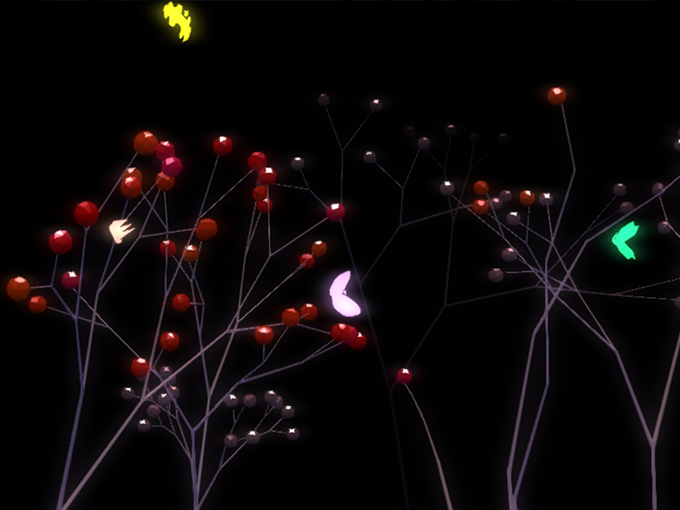

HFT-Garden
==========

This is an installation for the [HappyFunTimes system](http://docs.happyfuntimes.net).

If you want to see this running the steps are

1.  Install and Run [HappyFunTimes](http://docs.happyfuntimes.net/install.html)
2.  Install [HFT-Garden](http://superhappyfuntimes.net/game/hft-garden)
3.  Run it (after installing button under icon should change to `Launch`. Click that)
4.  Make sure your phone IS ON THE SAME WIFI as your computer then on your phone
    go to `http://happyfuntimes.net`

    **NOTE: This requires a home network. This will likely not work on a corporate WiFi nor will it work
    at an internet cafe.**

